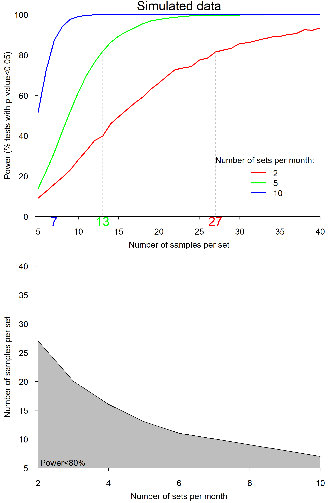

<!-- File.md is generated from File.Rmd. Please edit that file -->

# Conversion Factors – Power Analysis

A simple definition of power is the probability of detecting a change
using a statistical test. In the context of toothfish Conversion Factors
(CFs), which are generally normally distributed, power was here
calculated as the probability of detecting a 3% change in CFs using a
Student’s t-test, and the target power was set at the common level of
80%. The R script given below performs a Power Analysis on simulated CF
data and was first provided in Annex 2 of
[WG-SAM-2025/01](https://meetings.ccamlr.org/wg-sam-2025/01).

<a href="./Codes/CF_Power/CF_Power_Analysis.R" style="font-size: 18px; color: #337ab7; font-weight: bold">Download
R script</a>

------------------------------------------------------------------------

Figure 1. Results of the power analysis using simulated data. **Top**:
Power as a function of number of samples per longline set, for 3
different numbers of sets per month (red: 2 sets; green: 5 sets; blue:
10 sets). The horizontal dashed line indicates the target power of 80%
and coloured numbers on the x-axis indicate the required numbers of
samples per set to reach that target power. **Bottom**: 80% isoline of
power as a function of the number of samples per set and the number of
sets per month. The grey area indicates the zone of insufficient power.

 

## Steps

1.  Create a folder, a new R project in that folder, and put the R
    script in that folder,

2.  Run the script. A csv file and a figure (Fig. 1) should have been
    created in your folder.

 

<button onclick="window.location.href=&#39;./CF_Power_doc.html&#39;;">

Top
</button>

<button onclick="window.location.href=&#39;./&#39;;">

Home
</button>
